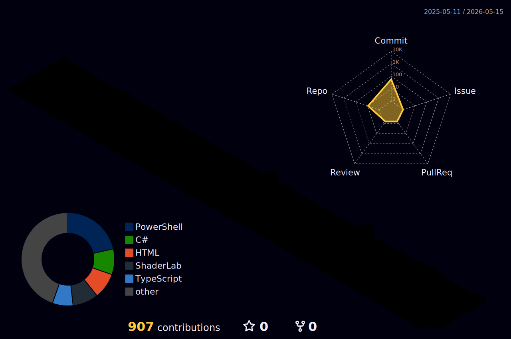

<p align="center">
  <a href="https://git.io/typing-svg"></a>
</p>

<p align="center">
  <a href="https://kanvas-kosong.itch.io"></a>
  <a href="https://www.last.fm/user/NRegret"></a>
  <a href="mailto:dickyh18@gmail.com"></a>
  
</p>

---

## 😼 About Me


```javascript
const nico = {
    location: "🌏 Somewhere cozy",
    mood: "😴 perpetually sleepy",
    code: ["C#", "TypeScript", "GDScript"],
    tools: ["Unity", "Godot", "React", "Blender"],
    funFact: "Same project for 3 years"
};
```

I'm a **chill grumpy lazy cat** who occasionally codes. Minimal effort, maximum comfort. I build things slowly, complain about it, and somehow ship stuff anyway. ✨

> *"Why do today what you can put off until tomorrow?"* 🐱

<br clear="right"/>

---

##  Tech Stack

<details>
<summary><b>🎮 Game Dev</b> — Unity, Godot, Blender</summary>
<p align="center">
  
  
  
  
  
</p>
</details>

<details>
<summary><b>🌐 Web Dev</b> — React, Svelte, TypeScript</summary>
<p align="center">
  
  
  
  
</p>
</details>

<details>
<summary><b>🛠️ Tools</b> — VS Code, FL Studio, Figma</summary>
<p align="center">
  
  
  
  
</p>
</details>

---

## 🎮 Featured Projects

| Project | Description | Stack |
|:--------|:------------|:------|
| **[Piew-Piew](https://kanvas-kosong.itch.io)** | Arcade shooter — shoot things, that's it | `Unity` `C#` |
| **KOGASU** 🚧 | Modern blogging platform (in progress) | `React` `TypeScript` |

<p align="center">
  <a href="https://kanvas-kosong.itch.io">
    
  </a>
</p>

---

## 📊 GitHub Stats

<p align="center">
  
  
</p>

<details>
<summary><b>📈 More Stats & Graphs</b></summary>
<br>

<p align="center">
  
</p>

<!-- Snake -->
<picture>
  <source media="(prefers-color-scheme: dark)" srcset="https://raw.githubusercontent.com/BigNeekode/BigNeekode/output/github-snake-dark.svg" />
  <source media="(prefers-color-scheme: light)" srcset="https://raw.githubusercontent.com/BigNeekode/BigNeekode/output/github-snake.svg" />
  
</picture>

<!-- Activity Graph -->
<p align="center">
  
</p>

<!-- 3D Contrib -->
<p align="center">
  
</p>

<!-- Metrics -->
<p align="center">
  
</p>

</details>

---

## 🎵 Now Vibing &nbsp;•&nbsp; 😹 Random Joke

<table>
<tr>
<td width="50%" align="center">

<a href="https://www.last.fm/user/NRegret">
  
</a>

</td>
<td width="50%" align="center">


</td>
</tr>
</table>

---

<p align="center">
  
</p>

<p align="center">
  
</p>


